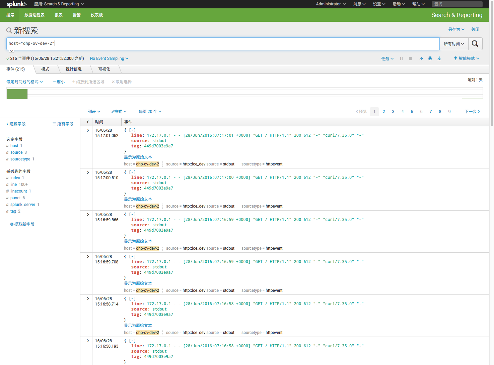
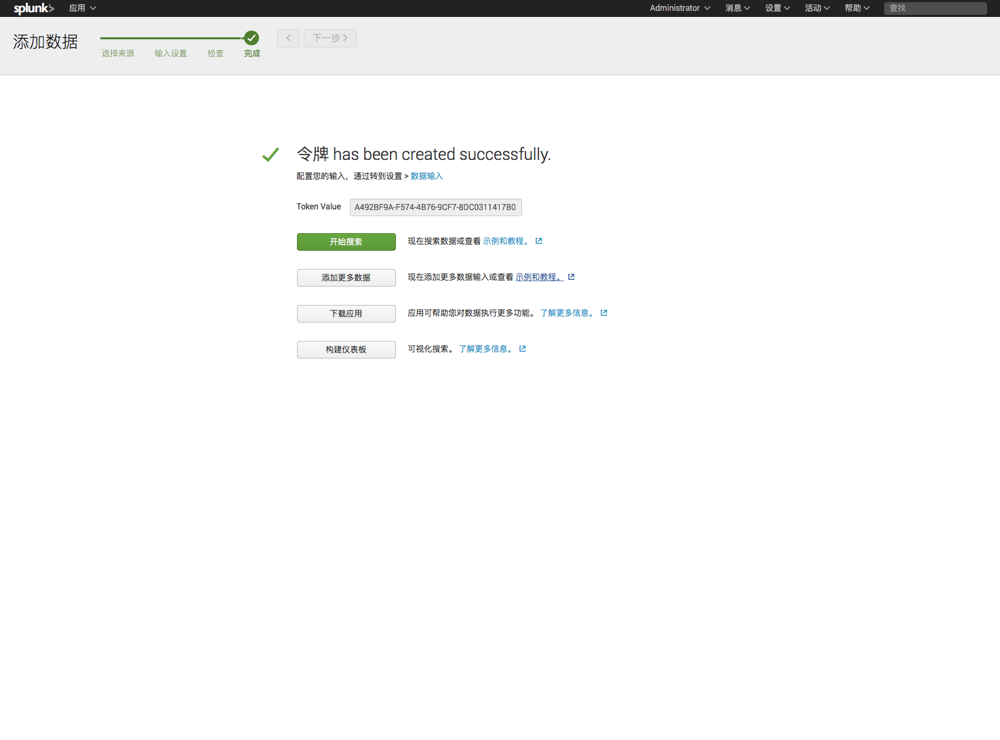

# Splunk

## 介绍

您可以通过 Splunk 收集和索引 DCE 集群中容器的日志信息。



## 前期准备

要用于收集日志的话，首先您需要创建一个 HTTP Event Collector 并记录它的 Token Value。



## 使用

您可以使用 Splunk 来收集容器的日志。

在启动容器时，可以通过指定 `log-driver` 来指定容器的日志引擎：

*假设您的 splunk 位于 `192.168.2.126`，且 HTTP Event Collector 使用端口 8088。*

```
docker run -d --log-driver=splunk --log-opt splunk-url=http://192.168.2.126:8088 --log-opt splunk-token=A492BF9A-F574-4B76-9CF7-8DC0311417B0 --log-opt splunk-insecureskipverify=true daocloud.io/nginx
```

参考:

* [Docker 集成 Splunk](https://docs.docker.com/engine/admin/logging/splunk/)